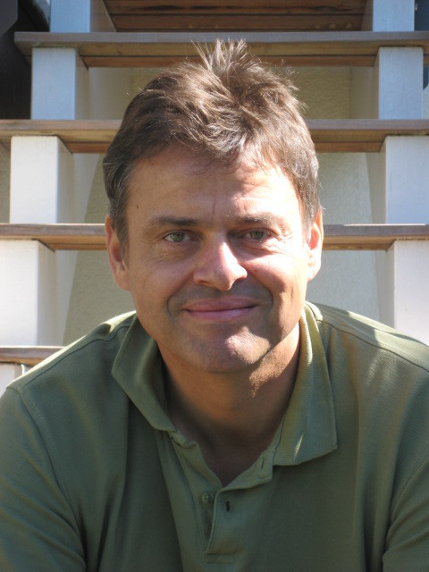
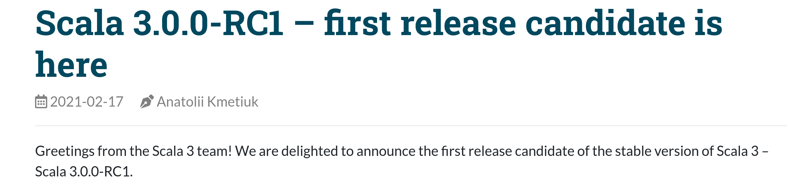
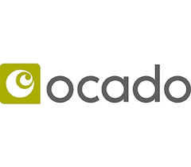
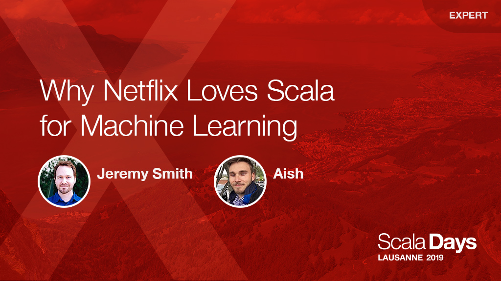
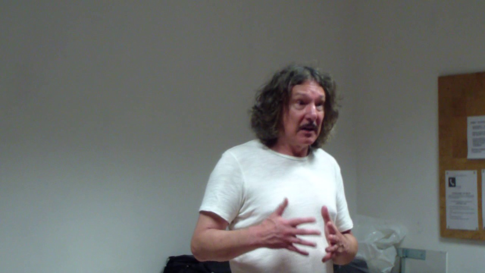

# Функционално програмиране за напреднали със Scala

2020/2021

<div id="left">

 <!-- .element height="70%" width="70%" -->

</div>

<div id="right">

 <!-- .element height="75%" width="75%" -->

</div>


## Какво ще ни се случи днес

Ще поговорим за:

* Какво ще се учи тука, бро?  <!-- .element: class="fragment" data-fragment-index="1" -->
* Кви са тия балъци?  <!-- .element: class="fragment" data-fragment-index="2" -->
* Администрация - Мега сериозно <!-- .element: class="fragment" data-fragment-index="3" -->
* Що ни се случва ФП-то <!-- .element: class="fragment" data-fragment-index="4" -->
* Scala! ...But also Scala 3! <!-- .element: class="fragment" data-fragment-index="5" -->
* Как да си сетъпна Notepad-а? <!-- .element: class="fragment" data-fragment-index="6" -->
* Ресурси за удавници  <!-- .element: class="fragment" data-fragment-index="7" -->

...then we start learning Scala.  <!-- .element: class="fragment" data-fragment-index="7" -->

<div id="bottom-right">

 <!-- .element height="50%" width="50%" -->

</div>


## Тук съм щото чух, че има понички?

Ще говорим за Функционално програмиране. Рекурсия. Монади. Апликативи. Ефекти...... <!-- .element: class="fragment" data-fragment-index="1" -->

<div id="bottom-center"> <!-- .element: class="fragment" data-fragment-index="1" -->

 <!-- .element height="50%" width="50%" -->

</div>

Ама истинско. Ще показваме неща от практиката - било то с конкурентност, уеб комуникации или други примери от конкретни домейни.  <!-- .element: class="fragment" data-fragment-index="2" -->

[Програма 2020/2021](https://learn.fmi.uni-sofia.bg/mod/url/view.php?id=185056) <!-- .element: class="fragment" data-fragment-index="2" -->


## Хората

* Здравко - ФМИ, Ocado, Scala since at least 2019 because that's when I met him. <!-- .element: class="fragment" data-fragment-index="1" -->
* Боян - Не от ФМИ, Не от Окадо, Не е писал Скала поне от 2018 (чaka Scala 3!) <!-- .element: class="fragment" data-fragment-index="2" -->
* Виктор - ФМИ, Оcado, Scala, Scala all the way... I guess? <!-- .element: class="fragment" data-fragment-index="3" -->
* Васил - Не знам дали от ФМИ, Ocado, пише Скала от преди да има Скала. <!-- .element: class="fragment" data-fragment-index="4" -->

<div id="bottom-right"> <!-- .element: class="fragment" data-fragment-index="4" -->


</div>


## Този слайд заради закона

* Всяка Сряда от 18 до 21. Освен следващата. Ама иначe - всяка (освен следващата, но всяка).
* Има Slack
* Има Github
* Има и Moodle.
* Remote докато не се ваксинирате

<div id="bottom-right">

 <!-- .element height="60%" width="60%" -->

</div>


## Най-скучната част

* Оценяване:
  * Няма изпит, има проект
  * Домашни:  4x10
  * Тестове:  2x25
  * Проект:  1x50
  * Random points щото ни кефите: Няколко
* Scala за оценяване:
  * Под 65 - 2
  * 65–79 - 3
  * 80–94 - 4
  * 95–109 - 5
  * 110+ - 6
  * 135+ - Водите тоя курс след 2 години


# ФП === Заплата над минималната

* 50-60 - Haskell Curry, McCarthy Lambda calculus, Lisp happens <!-- .element: class="fragment" data-fragment-index="1" -->
* 70's  - Types make an entrance - H&M type systems and inference algorithm still in use today <!-- .element: class="fragment" data-fragment-index="2" -->
* 80-90 - Standard ML, Common Lisp etc <!-- .element: class="fragment" data-fragment-index="3" -->
* Late 90's and the 00's - Ocaml + Haskell <!-- .element: class="fragment" data-fragment-index="4" -->
* 00 - Today - JVM more or less ruling the world <!-- .element: class="fragment" data-fragment-index="5" -->
* Meanwhile, concurrent systems and correctness gain importance <!-- .element: class="fragment" data-fragment-index="5" -->
* The Future - ...is Scala 3  <!-- .element: class="fragment" data-fragment-index="6" -->


# Междувременно... Мартин Одерски

<div id="left">

</div>

<div id="right">

* Професор в EPFL, Лозана
* Възхитен от ФП във време, в което Java изплува като платформа
* Решава да ги обедини в нов език – Pizza 🍕 – като добави елементи към Java
  * Типов полиформизъм (Generics)
  * Функции от по-висок ред
  * Pattern matching
* Имплементацията му на generics и изцяло новият компилатор, който написва, всъщност стават част от Java

</div>


# Стъпка назад

* Java има много ограничения
* Как би изглеждал език, комбиниращ ФП и ООП, ако го дизайнваме в момента?


# SCAlable LAnguage (Scala) – Януари 2004-та

<ul>
  <li class="fragment">Без (твърде) много feature-и в самия език</li>
  <li class="fragment">Вместо това малко, но пълно множество от мощни езикови конструкции</li>
  <li class="fragment">Имплементиране на feature-и в библиотеки, използвайки тези конструкции</li>
</ul>

<p class="fragment">Език, който скалира според нуждите</p>


# [Малка граматика](https://scala-lang.org/files/archive/spec/2.13/13-syntax-summary.html)

 <!-- .element height="60%" width="60%" -->


# Детайлна типова система

 <!-- .element height="60%" width="60%" -->


# Симбиоза на ФП и ООП


# Бъдещето

* DOT – математически модел за [есенцията на Scala](https://www.scala-lang.org/blog/2016/02/03/essence-of-scala.html)
* [Dotty](https://dotty.epfl.ch/) – изцяло нов компилатор с модерен дизайн, базиран на DOT
* [Scala 3](https://docs.scala-lang.org/scala3/new-in-scala3.html) – опростяване и допълване на езика

<div id="bottom-center"> <!-- .element: class="fragment" data-fragment-index="1" -->



</div>


# Scala in the Wild

* Very much in production all over the world.
* Used by: Twitter, Netflix, Databricks etc.
* Locally by Ocado, Hopper, AtScale & others.
* Lots of open sources projects and an active distributed community
  * Kafka, Spark, Akka, Play Framework, ...

<div id="bottom-left">



</div>

<div id="bottom-left">

  <!-- .element height="40%" width="40%" -->

</div>


# Boring code examples do not look

Chain:

```scala
competitors
  .filter(_.age >= 18)
  .map(_.score)
  .sorted(Ordering[Int].reverse)
  .take(100)
  .sum
```

DSL Building:

```scala
implicit class Pipe[T](x: T) {
  def |>[V](f: T => V) = f(x)
}

10 |> square |> { double(_) * 100 } |> square |> { _ + 1 } //
```


# How do we run Scala?

* We assume we have a jvm – 8 or 11. Not JVM 9, for reasons! <!-- .element: class="fragment" data-fragment-index="1" -->
* The Scala Compiler <!-- .element: class="fragment" data-fragment-index="2" -->
 * [Here](https://www.scala-lang.org/download/) <!-- .element: class="fragment" data-fragment-index="2" -->
* SBT - The Scala Build Tool  <!-- .element: class="fragment" data-fragment-index="3" -->
 * [Here](https://www.scala-sbt.org/)  <!-- .element: class="fragment" data-fragment-index="3" -->
* [(or install all of the above at once)](https://www.scala-lang.org/2020/06/29/one-click-install.html) <!-- .element: class="fragment" data-fragment-index="4" -->
* An Editor of Choice - IntelliJ or anything with LSP support <!-- .element: class="fragment" data-fragment-index="5" -->
 * [IntelliJ](https://www.jetbrains.com/idea/)  <!-- .element: class="fragment" data-fragment-index="5" -->
 * [Metals - Scala LSP](https://scalameta.org/metals/) <!-- .element: class="fragment" data-fragment-index="5" -->


# Bedtime reading

* [FP in Scala](https://www.manning.com/books/functional-programming-in-scala) (book)
* [Programming in Scala 4th ed](https://booksites.artima.com/programming_in_scala_4ed) (book)
* [Scala with Cats](https://underscore.io/books/scala-with-cats/) (book)
* A lot of posts and articles on Scala 3 and dotty on the official website
* Some of Odersky's Scala 3 videos, start with latest.
* As a side: Bartosz Milewski's Cat Theory Video series: [Starts here](https://www.youtube.com/watch?v=I8LbkfSSR58)

 <!-- .element height="60%" width="60%" -->


# FINITO


