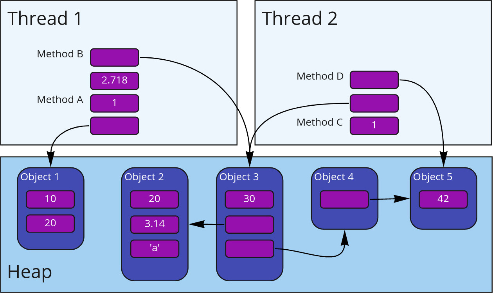

# Досега

::: incremental

* Програми с мощността на ламбда смятането/машината на Тюринг
* Последователни изчисления, не се влияят от времето
* Нямат връзка с околния свят
* вход =&gt; предвидима трансформация =&gt; изход
* Трансформиращи програми
* Добре изучени, "лесни"

:::

# IO

```scala
import Console._

val program = for {
  _     <- putStrLn("What is your name?")
  name  <- getStrLn
  _     <- putStrLn("Hello, " + name + ", welcome!")
} yield ()

program.unsafeRun()

doSomethingElse()
```

::: incremental

* Връзка с външния свят
* Но синхронна – програмата не прави нищо друго докато чака
* Интерактивни програми

:::

# Реалният свят

::: incremental

* Светът навън е силно паралелен и конкурентен
* Нещо повече, участниците в него си взаимодействат
* Развива се във времето
* Как да моделираме такива програми?

:::

# Конкурентност и паралелизъм


<div class="align">
  <dl class="fragment">
    <dt>parallel</dt>
    <dd>from παρά + ἄλληλος, along each other</dd>
  </dl>

  <dl class="fragment">
    <dt>concurrent</dt>
    <dd>present active participle of concurrō (“happen at the same time with”), from con- (“with”) + currō (“run”)</dd>
  </dl>

  <dl class="fragment">
    <dt>concurrent computing</dt>
    <dd>a form of computing in which several computations are executed during overlapping time periods—concurrently—instead of sequentially</dd>
  </dl>
</div>

# Конкурентност

В изчислителен контекст:

::: incremental

* _конкурентността_ се отнася към структурата на програмата,
* _паралелизмът_, _дистрибутираността_ – към хардуера и как тя ще бъде изпълнявана.

:::

<p class=fragment>Конкурентните програми са композитност от unit-и от изчисления, които, веднъж дефинирани, могат да бъдат изпълнени независимо едно от друго.</p>

# Дистрибутираност

::: { .fragment }

Независими компоненти със собствени изчислителни ресурси и памет, които комуникират помежду си чрез съобщения и изграждат цялостна система

:::

::: { .fragment }

> "A distributed system is one in which the failure of a computer you didn't even know existed can render your own computer unusable."

:::

# Реактивност

<p class="fragment">Свойството на програмите/компонентите да реагират<br />на света около тях<span class="fragment"> (с което да са част от него)</span></p>

# Конкурентни модели

::: incremental

* От ниско ниво
  * Нишки
  * I/O и TCP/IP конкурентност
* Абстракции
  * Callbacks & event loop
  * Future/Promise & IO
  * Актьорски модел
  * Communicating Sequential Processes
  * Stream/dataflow конкурентност
  * ...нещо друго?
  
:::

# Какво би направило един модел подходящ?

::: incremental

* Ease to reason about it
* Expressive
* Safe
* Doesn't hide possibility for errors<span class="fragment"> (e.g. in a distributed setting)</span>
* Composable
* Functional programming to the rescue

:::

# Нишки

* Кой е ползвал НИШКИ?

# Как си комуникират нишките?



# ...чрез споделено състояние!

::: incremental

* За да бъде смислен, всеки конкурентен примитив е нужно да има поне една интеракция с околния свят или с други примитиви
* Границите с дистрибутираните системи се размиват
* Нишки – чрез споделена памет и средства на процесора и ОС
* Модел на синхронизация:

  { height=420 }

:::

# Видимост между нишки

::: { .fragment }

{ height=380 }

:::

::: { .fragment }

Видимост чрез `volatile`

:::

# Happens-before

::: incremental

* Запис във `volatile` променлива __се случва преди__ последващо нейно прочитане (от същата или друга нишка)
* За всеки два последователни statement-а в една нишка, първият __се случва преди__ вторият
* Релацията е транзитивно затворена

:::

::: { .fragment } 

Образува се частична наредба

:::

# Happens-before

::: incremental

* JVM ни гарантира:
  * всяка референция към immutable обект сочи към обект с напълно валидно състояние
* неизменимостта премахва огромен клас от възможни грешки

:::

# Проблеми на нишките

::: incremental

* Тежки – всяка има стек, регистри, превключването е бавно и минава през ядрото на ОС, стартират бавно
* Липсва реактивност
  * но могат активно да създадат други нишки
  * и да променят споделено състояние
* Комуникират
  * чрез споделено състояние
  * чрез синхронни и блокиращи операции<span class="fragment"> – докато операцията не завърши нишката не може да прави нищо друго</span>
* Не се композират
* [The Problem with Threads](https://www2.eecs.berkeley.edu/Pubs/TechRpts/2006/EECS-2006-1.pdf)

:::

# Callbacks


```scala
def doSomething(onComplete: Result => Unit): Unit
```

::: incremental

* Асинхронни и реактивни
* Задействат се при завършване на работа или при определено събитие <span class="fragment">(естествени за event loop)</span>
* Ще ги изпълним върху pool от нишки (брой = ~брой ядра)

:::

<div class="fragment">

```scala
def doSomethingDangerous(onComplete: Try[Result] => Unit): Unit
```

</div>

# Callbacks – негативи

::: incremental

* Императивни, работят с mutable state
* Некомпозитни. Callback hell
* Ако се изпълняват в различни нишки, изискват синхронизация
* Ръчно спряване с грешки

:::

# Future

Какво бяхме постигнали с `IO`?

::: incremental

* Страничен ефект =&gt; функционален ефект
* Защо това ни харесва?
* Функционално композиране на ефекти (по определена операция)
* Странични ефекти само при изпълнение

:::

#

Как би изглеждал `Future`

# Защо точно тези операции?

::: { .fragment }

[Лекция 2: Императивно срещу Функционално](02-fp-with-scala.html#/функционално-срещу-императивно)

:::

::: { .fragment }

При императивното всяка нишка описва собствена времева линия, преплитаща се с другите

:::

# Функционално програмиране

{ height="512" }

# Изрази

```scala
val a = 10
val b = 40

val c = a * 10
val d = (a, b)
val e = a + b

def f(x: Int): String = ???
def g(x: String): Boolean = ???

def r = f(g(a))
```

# Ефектни изрази

```scala
val a = Future(10)
val b = Future(40)

val c = a.map(_ * 10)
val d = a zip b
val e = a.zipMap(b)(_ + _)

def f(n: Int): Future[String] = ???
def g(str: String): Future[Boolean] = ???

def r = a.flatMap(f).flatMap(g)
```

# Ефектни изрази

```scala
val a = Future(10)
val b = Future(40)

val c = a.map(_ * 10)
val d = a zip b
val e = a.zipMap(b)(_ + _)

def f(n: Int): Future[String] = ???
def g(n: Int, str: String): Future[Boolean] = ???

def r = for {
  n <- a
  str <- f(n)
  bool <- g(n, str)
} yield bool
```

# Имплементация. Eager или lazy?

::: incremental

* Ще разгледаме и двата варианта
* Стандартния Scala Future работи eagerly
* `Future` се изчислява асинхронно =&gt; допустимо е да се изчисляват eagerly
* т.е. изчислението да започне веднага след дефинирането и когато станат готови всички зависимости
* композицията на ефектите остава функционално

:::

# Имплементация

# Реактивност на `Future`

::: incremental

* Ще се базираме на callback – `onComplete`
* Функционалните трансформации – чрез `onComplete`
* Трансформиран `Future` също е реактивен
* Как да го вържем с външни източници на събития?
* Promise
  * Promise-ите ще генерират първоначални Future-и в нашата система
  * Адаптер към външния свят – реагират на събития за вход/изход

:::

<!--
  * изпълнява се когато неговите зависимостти завършат (като реакция)
  * при завършване зависимите от него трансформации могат да се изпълнят
-->

# Примери

# Immutability

Future е безопасен, само ако стойностите в него са immutable!

<p class="fragment">Ако не са, то тяхното състояние може да е неизвестно</p>

# Асинхронен вход/изход чрез `Future`

::: { .fragment }

Как работи HTTP?

:::

# `Future` в Scala

* `scala.concurrent.Future`
* Използва `ExecutionContext` вместо `Executor`
* default: `import scala.concurrent.ExecutionContext.Implicits.global`

# Съществуваща стойност към `Future`

```scala
Future.successful(value)
Future.failed(exception)
```

# Recover

```scala
def doSomethingForUser(userId: Id): Future[HttpResponse] =(for {
  user <- retrieveUser(userId)
  result <- doService(user, input)
} yield Ok(constructBody(result))) recover {
  case UserNotFound(userId) => NotFound
  case _: ActionNotPermitted => Unauthorized
}
```

# Recover with друга, по-стабилна алтернатива

```scala
def dangerousService(input: ServiceInput): Future[Result] = ???
def safeService(input: ServiceInput): Future[Result] = ???

def calculate(input: ServiceInput): Future[Result] = {
  dangerousService(input).recoverWith {
    case _: ServiceFailure => safeService(input)
  }
}
```

# Състезание

```scala
def algorithm1(input: String): Future[Int] = ???
def algorithm2(input: String): Future[Int] = ???

def calculation(input: Stirng): Future[Int] =
  Future.firstCompletedOf(List(algorithm1(input), algorithm2(input)))

```

# Неопределен брой независими изчисления

```scala
def retrieveAge(userId: Id): Future[Int] = ???

def averageFriendsAge(user: User): Future[Option[Int]] = for {
  friendIds: List[Id] <- user.friends
  friendsAges: List[Future[Int]] = friendIds.map(retrieveAge)
  ages <- Future.sequence(friendsAges): Future[List[Int]]
} yield average(ages)
```

# Референтна прозрачност

```scala
def calc[T](expr: => T) = Future {
  Thread.sleep(4000)

  expr
}
```

::: { .fragment }

```scala
val futureA = calc(42)
val futureB = calc(10)

val sum = for {
  a <- futureA
  b <- futureB
} yield a + b

println {
  Await.result(sum, 5.seconds)
}
```

:::

::: { .fragment }

```
> 52
```

:::

# Референтна прозрачност

```scala
def calc[T](expr: => T) = Future {
  Thread.sleep(4000)

  expr
}
```

```scala
val sum = for {
  a <- calc(42)
  b <- calc(10)
} yield a + b

println {
  Await.result(sum, 5.seconds)
}
```

::: { .fragment }

```
> Exception in thread "main" java.util.concurrent.TimeoutException: Futures timed out after [5 seconds]
```

:::

# Правилният начин да постигнем паралелилизъм:

```scala
val sum = for {
  (a, b) <- calc(42).zip(calc(10))
} yield a + b

println {
  Await.result(sum, 5.seconds)
}
```

```
> 52
```

# Как да се справим с това?

::: { .fragment }

Отговор следващия път 😊

:::

# Въпроси :)?
