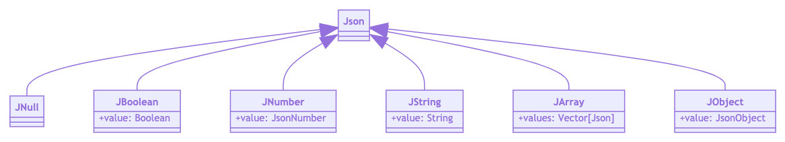

# Scala

Вече познаваме Scala доста добре

{ height=420 }

::: { .fragment }

Вече всички можем да се наречен функционални магьосници :)

:::

# Моделиране на домейни

::: incremental

* в последните лекции бяхме малко по-абстрактни
* но най-силно ползата от ФП се проличава когато приложим изразните му средства в конкретни домейни
* Днес и следващия път ще опитаме да изградим цялостно конкретно приложение
    - Функционално
    - с HTTP, JSON, SQL база
    - с бизнес домейн (уеб магазин)

:::

# Избор на IO ефект<br />(асинхронност и конурентност)

* [Cats Effect IO](https://typelevel.org/cats-effect)
* [ZIO](https://zio.dev/)
* [Monix Task](https://monix.io/docs/current/eval/task.html)
* Future

::: { .fragment }

Първите три предоставят имплементация на Cats Effect type class-овете

:::

# Още един поглед към Cats Effect IO

# Cats Effect Type Class-ове

[{ height=520 }](https://typelevel.org/cats-effect/docs/typeclasses/)

# Безопасно боравене с Resource-и

::: { .fragment }

Тоест функционален вариант на [using](04-key-fp-approaches.html#/%D0%B8%D0%BC%D0%BF%D0%BB%D0%B5%D0%BC%D0%B5%D0%BD%D1%82%D0%B8%D1%80%D0%B0%D0%BD%D0%B5-%D0%BD%D0%B0-%D1%81%D0%BE%D0%B1%D1%81%D1%82%D0%B2%D0%B5%D0%BD%D0%B8-%D0%BA%D0%BE%D0%BD%D1%81%D1%82%D1%80%D1%83%D0%BA%D1%86%D0%B8%D0%B8-1/0)

:::

# Структуриране на кода

# Зависимости

Чистите функции често рефирират към други конкретни функции.

```scala
def countHttpResourceWords(url: String): IO[Long] =
  HttpUtils.get(url).map(_.body).map(countWords)
```

::: { .fragment }

Често обаче бихме желали да се абстрахираме от конкретната имплементация на тези функции

:::

# Зависимости

Във ФП това може да постигнем като функцията се подава като параметър:

```scala
def countHttpResourceWords(retrieveUrl: String => HttpResponse)(url: String): IO[Long] =
  retrieveUrl(url).map(_.body).map(countWords)

val asyncHttpCountHttpResourceWords = countHttpResourceWords(AsyncHttpClient.get) _
```

# Dependency injection

::: incremental

* Този подход наричаме със сложното име “Dependency injection”
* Вид inversion of control – функцията вече не създава/реферира изрично конкретна зависимост, ами я приема като параметър

:::

# Dependency injection чрез ООП модулност

::: { .fragment }

```scala
trait HttpClient {
  def get(url: String): IO[HttpResponse]
  def post(url: String)(entity: Entity): IO[HttpResponse]
}
```

:::

::: { .fragment }

```scala
class ResourceProcessor(httpClient: HttpClient) {
  def countHttpResourceWords(url: String): IO[Long] =
    httpClient.get(url).map(_.body).map(countWords)
}

```

:::

::: { .fragment }

```scala
val httpClient = new AsyncHttpClient
val resourceProcessor = new ResourceProcessor(httpClient)

resourceProcessor.countHttpResourceWords("http://example.org")
```

:::

# Защо dependency injection?

* Less coupling
  * не сме зависими от конкретна имплементация
  * винаги можем да я сменим с друга
  * зависими сме единствено от конкретен интерфейс
* позволява тестване
* зависимостите на всеки компонент стават по-явни

# Кой навързва зависимостите?

::: incremental

* По време на изпълнение – популярно в Java света ([Guice](https://github.com/google/guice), [Spring](https://spring.io/))
* По време на компилация

:::

# Compile-time dependency injection – демо

# Thin cake pattern

# Как да определим кои да са модулите

::: incremental

* инфраструктурни/библиотечни – занимаващи се с конкретна библиотека или конкретна част от инфраструктурата на приложението 
* домейн модули – за всеки домейн/поддомейн

:::

# Уеб магазин

Домейни:

* Управление на потребителите (регистрация, информация за потребителите, аутентикация)
* Инвентар (продукти, наличност и т.н.)
* Магазин и поръчки

::: { .fragment }

Подход:

::: incremental

* Всеки от тях може да бъде отделен модул, развиващ се сравнително самостоятелно
* Една промяна обикновено засяга един модул, който в бъдеще може да бъде отделен и в отделен service
* Напълно естествено разделение

:::

:::

# Разделение по слоеве?

::: incremental

* Например model, repository, service, controller
* Почти винаги не работи добре за по-големи приложения
* Една промяна често засяга няколко модула/пакета
* Компоненти с по-силна връзка помежду си остават по-отдалечени
* Понякога може да е полезно като второстепенно разделение

:::

# Още информация

[DI in Scala guide](https://di-in-scala.github.io/)

# Глобални ресурси?

::: incremental

* Много често приложенията съдържат ресурси, които трябва да се инициализират (при стартиране) и зачистват (при спиране)
  - thread pools
  - връзки към базата
  - уеб сървър
  - ...
* Масово в JVM приложение се среща това да не се прави
* При подхода за DI, който разгледахме, това изисква известно количество mutability
* По-късно ще разгледам как лесно може да постигнем безопасност чрез Resource

:::

# Връзка със SQL база от данни

* [Doobie](https://tpolecat.github.io/doobie/)
* [Skunk](https://tpolecat.github.io/skunk//)
* [Quill](https://getquill.io/)
* [Slick](https://scala-slick.org/)
* [Сравнение](https://softwaremill.com/comparing-scala-relational-database-access-libraries/)

# Doobie

::: incremental

* стъпва върху Cats и Cats Effect
* вътрешно използва JDBC

:::

# Doobie – Демо

# Doobie – сериализация/десериализация към/от заявка

[Anatomy of a Doobie query](https://cdn.rawgit.com/tpolecat/doobie-infographic/v0.6.0/doobie.svg)

# JSON библиотеки

* [circe](https://circe.github.io/circe/) - базира се на cats
* [play-json](https://github.com/playframework/play-json) - първоначално част от Play Framework, извадена в последствие. Използва jackson.
* [json4s](https://github.com/json4s/json4s) - "This project aims to provide a single AST to be used by other scala json libraries"

# [Circe](https://circe.github.io/circe/)

A JSON library for Scala powered by Cats

# JSON types



# Circe workflow

Encoding<br/>
`Data Model -> Encoder -> Json -> String`

<br/>

Decoding<br/>
`String -> Parser -> Json -> HCursor -> Decoder -> Data Model`

# Encoders

```scala
trait Encoder[A] {
  def apply(a: A): Json
}

implicit class EncoderOps[A](val wrappedEncodeable: A) {
  def asJson(implicit encoder: Encoder[A]): Json = encoder(wrappedEncodeable)
  def asJsonObject(implicit encoder: ObjectEncoder[A]): JsonObject =
    encoder.encodeObject(wrappedEncodeable)
}
```

# Encoder examples

`circe/examples/IdCard`

# Decoding

`String -> Parser -> Json -> HCursor -> Decoder -> Data Model`

```scala
trait Parser {
  def parse(input: String): Either[ParsingFailure, Json]
  def decode[A: Decoder](input: String): Either[Error, A]
}

trait Decoder[A] {
  def apply(c: HCursor): Decoder.Result[A]
}
```

# Добавяне на circe към проект

```scala
val circeVersion = "0.14.1"

libraryDependencies ++= Seq(
  "io.circe" %% "circe-core",
  "io.circe" %% "circe-generic",
  "io.circe" %% "circe-parser"
).map(_ % circeVersion)
```

* `circe-core` - core data type and type classes
* `circe-generic` - uses Shapeless to auto-generate Decoder/Encoder for case classes.
* `circe-parser` - Parser type class for decoding JSON

# HTTP библиотеки

* [http4s](https://http4s.org/) - based on cats-effect and fs2 (streaming)
* [akka-http](https://doc.akka.io/docs/akka-http/current/index.html) -
  full server- and client-side HTTP stack on top of akka-actor and akka-stream
* [Play Framework](https://www.playframework.com/) - build on Akka
* [Scalatra](http://scalatra.org/) - influenced on Ruby’s Sinatra. "microframework"

# http4s

> Http applications are just a Kleisli function from a streaming request to a polymorphic effect of a streaming response.
So what's the problem?


<div class="fragment">
Нека разгледаме как е изграден http4s
</div>


# Започваме просто

```scala

case class Request(
    method: Method,
    uri: Uri,
    // headers,
    // httpVersion,
    body: EntityBody
)

case class Response(
    status: Status,
    // headers,
    // httpVersion,
    body: EntityBody
)

```

#

```scala
type HttpApp = Request => IO[Response]

type HttpRoutes = Request => IO[Option[Response]]
object HttpRoutes {
  def of(pf: PartialFunction[Request, IO[Response]]): HttpRoutes = pf.lift
}
```

<div class="fragment">

```scala
type Http[F[_]] = Request => F[Response]
type HttpApp = Http[IO]

type HttpRoutes = Http[IO[Option[_]]]
```

</div>

#

```scala
type Http[F[_]] = Request => F[Response]
type HttpApp = Http[IO]

type OptionIO[A] = IO[Option[A]]
type HttpRoutes = Http[OptionIO]
```


# [OptionT](https://typelevel.org/cats/datatypes/optiont.html)

> OptionT[F[_], A] is a light wrapper on an F[Option[A]]

<div class="fragment">

```scala
import cats.data.OptionT

type Http[F[_]] = Request => F[Response]
type HttpApp = Http[IO]

type OptionTIO[A] = OptionT[IO, A]
type HttpRoutes = Http[OptionTIO] 
```

</div>

<div class="fragment">

[Kind Projector](https://github.com/typelevel/kind-projector)
```scala
type HttpRoutes = Http[OptionT[IO, *]]
```

</div>

# Какво имаме накрая

```scala
type Http[F[_]] = Request => F[Response]

type HttpApp = Http[IO]

type HttpRoutes = Http[OptionT[IO, *]]
object HttpRoutes {
  def of(pf: PartialFunction[Request, IO[Response]]): HttpRoutes =
    req => OptionT(pf.lift(req).sequence)
}
```

# Всъщност е малко по-различно

[Kleisli](https://typelevel.org/cats/datatypes/kleisli.html)
```scala
type Http[F[_]] = Kleisli[F, Request, Response]
```

<div class="fragment">
Освен това - IO не е фиксирано

```scala
type HttpApp[F[_]] = Http[F]

type HttpRoutes[F[_]] = Http[OptionT[F, *]]
object HttpRoutes {
  def of[F[_]: Defer: Applicative](pf: PartialFunction[Request[F], F[Response[F]]]): HttpRoutes[F] =
    Kleisli(req => OptionT(Defer[F].defer(pf.lift(req).sequence)))
}
```

</div>

# Examples

# middlewares

* [документация](https://http4s.org/v0.23/middleware/)
* [Authentication](https://http4s.org/v0.23/auth/)
* Cross Origin Resource Sharing ([CORS](https://http4s.org/v0.23/cors))
* Response Compression ([GZip](https://http4s.org/v0.23/gzip))
* [Metrics](https://http4s.org/v0.23/api/org/http4s/server/middleware/Metrics)
* [X-Request-ID header](https://http4s.org/v0.23/api/org/http4s/server/middleware/RequestId)

# http client

* Освен сървърна част, `http4s` има и HTTP клиент
* [пример от документацията](https://http4s.org/v0.23/client/)


# Потоци

* [Fs2](https://fs2.io/)
* [Akka Streams](https://doc.akka.io/docs/akka/current/stream/index.html)
* [Monix](https://monix.io/)
* [Play Iteratees](https://www.playframework.com/documentation/2.8.x/Iteratees)

# Fs2 – Демо

# Въпроси :)?
